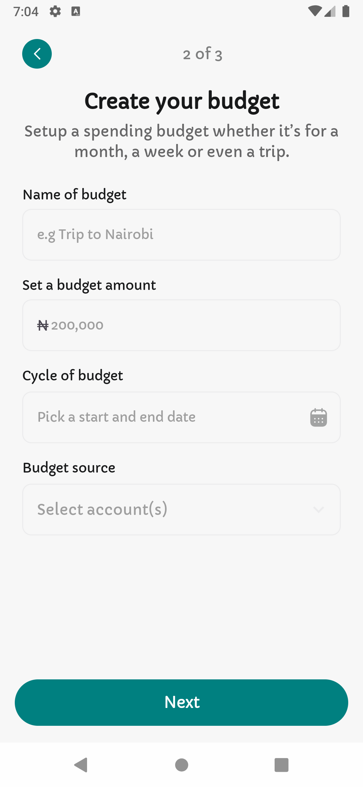

# FinTrack

An intuitive personal finance management app that helps users budget, track expenses, and save money
effectively

## Languages, libraries and tools

* Kotlin
* Jetpack compose
* Coil - image loading
* KotlinX serializer

## Screenshots

  
  
  
  
  
  
  
  

